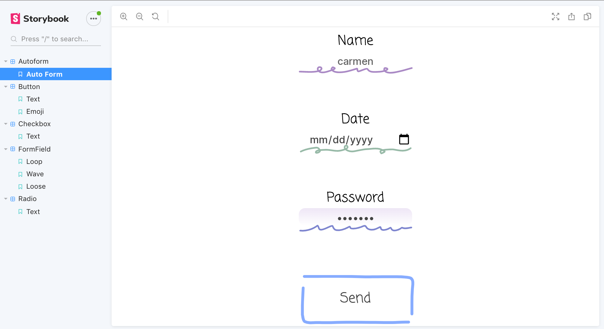

# VYBE Component Library

This project is the implementation of a custum component library where the components look like hand drawn doodles.
This project was created using [Storybook](https://storybook.js.org/) and [Create React App](https://github.com/facebook/create-react-app).

> AutoForm component created using Input and Button component
>  

### Available Scripts

In the project directory, you can run:

## Development

### `npm i`

First, install dependencies

### `npm start`

Runs the storybook, and you will be able to see every component from src/components. 
Open [http://localhost:9009](http://localhost:9009) to view it in the browser.

The page will reload if you make edits. 

> AutoForm in Storybook environment

### `npm test`

Launches the test runner in the interactive watch mode. 
Press `a` to run all tests
Press `f` to run only failed tests
Press `u` to automatically updated failing snapshot tests

### `npm run build`

Builds the app for production to the `build` folder. 
It correctly bundles React in production mode and optimizes the build for the best performance.

The build is minified and the filenames include the hashes. 
Your app is ready to be deployed!
