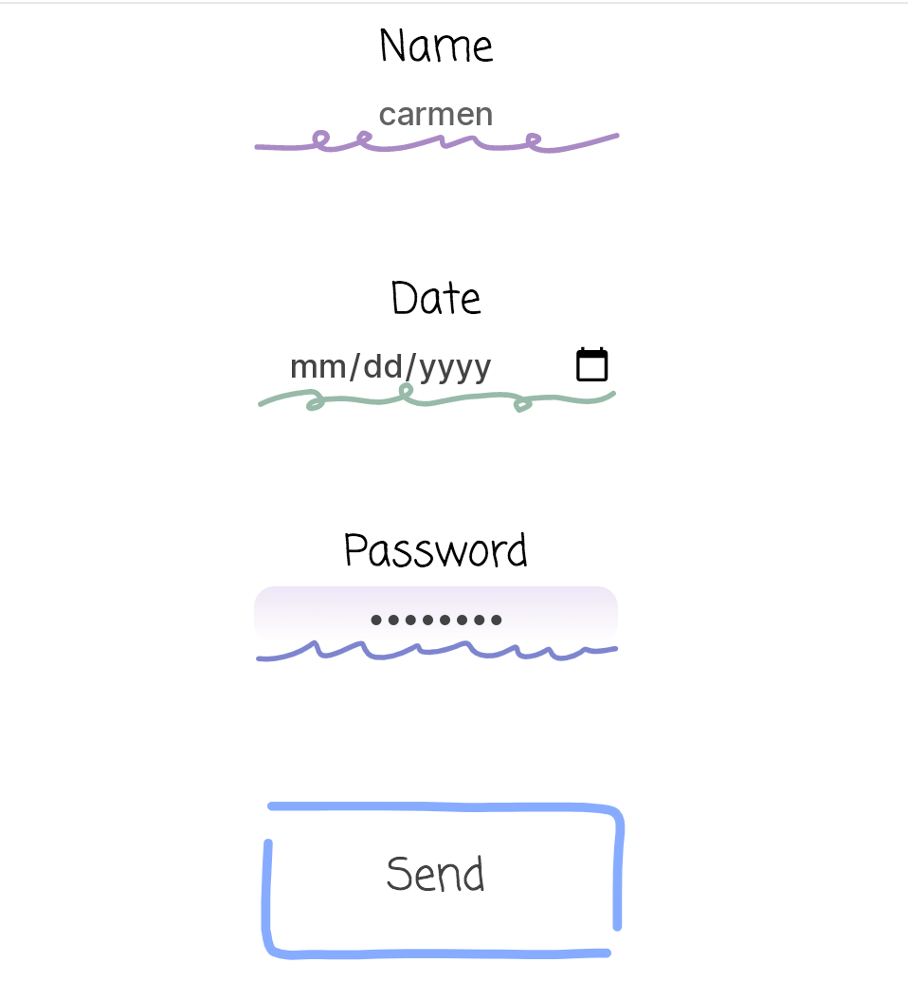

# VYBE Component Library

A custom React component library featuring hand-drawn, doodle-style UI components. Built with React 18 and Storybook 8.

##### [Link to recent Storybook build on Chromatic](https://695f719bc3022c5796a2d716-luwzldsejg.chromatic.com/?path=/story/autoform--auto-form)

---


> AutoForm component created using Input and Button components


## Project Overview

VYBE Library is a react component library inspired by hand-drawn doodles to add a fun and
personalized look to any React project. This component library is built with React, utilizing
Storybook and Chromatic for build tracking, collaboration, and demoing. VYBE is designed to
be easy to customize components for size and color to match and fit the look of any React
project. The components in VYBE are dynamic, mobile-friendly, and built with accessibility best
practices top of mind. This library is tested with Jest, React Testing Library, and React Test
Renderer, for component rendering and snapshot testing.


**Key Features:**
- Hand-drawn aesthetic using Rough.js for sketchy, doodle-like appearance
- Full Storybook integration for component documentation and interactive playground
- Comprehensive test suite with Jest, React Testing Library, and Chromatic for visual regression testing
- Customizable components with color, size, and style props
- Responsive design that works across all device sizes


## Tech Stack

### Core Technologies
- **React 18.2.0** - Modern React framework with hooks and concurrent features
- **React DOM 18.2.0** - React rendering library for the web
- **Create React App 5.0.1** - Build tooling and development environment setup

### Styling & Graphics
- **Styled Components 6.1.1** - CSS-in-JS styling solution for component-scoped styles
- **Rough.js 4.3.1** - Hand-drawn graphics library that creates sketchy, imperfect shapes
- **React Rough 2.3.0** - React bindings for Rough.js to integrate hand-drawn graphics
- **Anime.js 3.2.0** - Animation library for smooth interactive effects and transitions

### Development & Documentation
- **Storybook 8.6.15** - Component development environment and documentation tool

### Testing
- **Jest** - JavaScript test runner (included via react-scripts)
- **React Testing Library 16.0.0** - Simple and complete testing utilities for React components
- **React Test Renderer 18.2.0** - Lightweight testing utilities for snapshot testing
- **Chromatic 13.3.5** - Visual regression testing and component review platform

### Build & Deployment
- **Webpack 5** - Module bundler (configured via Storybook)
- **Babel** - JavaScript compiler (configured via react-scripts)

## Components

- **Button**: Hand-drawn border styling with hover animations, customizable color and size
- **FormField**: Three variants (Loop, Wave, Loose) for text, password, and date inputs
- **Checkbox**: Customizable fill colors and font sizes with interactive states
- **Radio**: Customizable appearance with hand-drawn circle border
- **AutoForm**: Dynamic form generator that creates complete forms from JSON configuration


## Getting Started

### Installation

```bash
git clone <repository-url>
cd VYBE-LIB
npm install
```

### Development

```bash
npm start          # Start Storybook on http://localhost:9009
npm test           # Run tests in watch mode
npm run build-storybook    # Build for production
npm run preview-storybook # Preview static build on port 8080
npm run chromatic  # Publish to Chromatic (requires token)
```

## Testing

The project includes a comprehensive test suite with render tests, query tests, snapshot tests, and visual regression testing with Chromatic. Test coverage includes Button, AutoForm, and all FormField variants.

## Building & Deployment

Build creates a static `storybook-static` directory deployable to Netlify, Vercel, GitHub Pages, or any static hosting service.

## Usage Example

```jsx
import Button from './components/Button/Button';

<Button color="#6d6" size="md" onClick={handleClick}>
  Click Me
</Button>
```

## Project Structure

```
VYBE-LIB/
├── src/components/     # Button, FormField, Checkbox, Radio, AutoForm
├── .storybook/      # Storybook configuration
├── images/          # Documentation images
└── public/          # Static assets
```

## License

This project is private and proprietary.